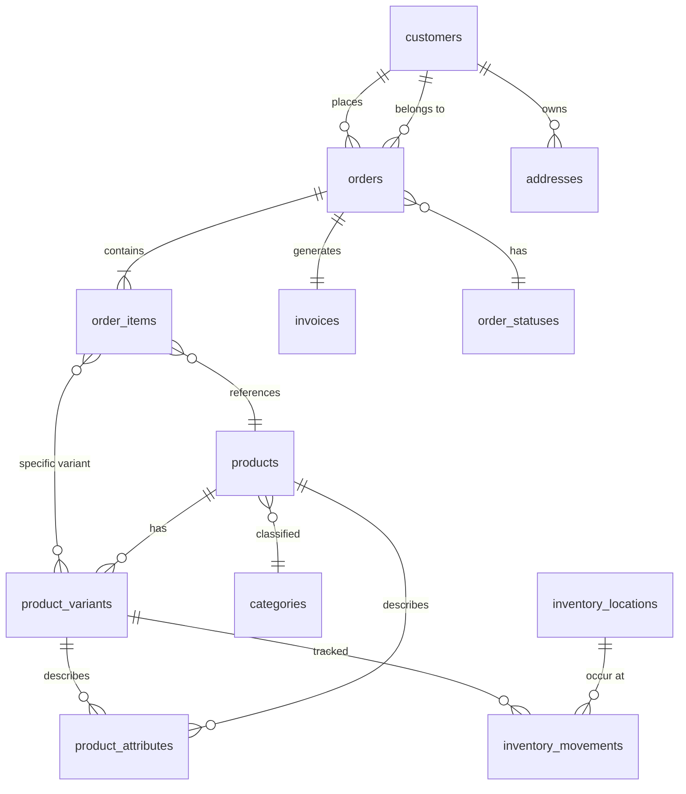

# Commerce Data Model Refresh

## Aktuální tabulky a jejich stav

| Tabulka | Účel | Poznámky k budoucnosti |
|---------|------|------------------------|
| `users` | Uživatelé systému a zákazníků | Zachovat; napojení na `customers.user_id`. |
| `posts` | Články, stránky i produkty (přes `type`) | Nahradí ji specializovaná tabulka `products`; obsah pro typy `post`/`page` zůstává. |
| `media` / `post_media` | Správa médií a vazby na obsah | Zachovat pro assety produktů i obsahu. |
| `terms` / `post_terms` | Kategorizace obsahu | Pro katalog vzniká tabulka `categories`; terminologie pro blog může zůstat. |
| `settings` | Konfigurace aplikace | Zachovat. |
| `navigation_*` | Navigační menu | Zachovat. |
| `comments` | Komentáře k článkům | Zachovat pouze pro obsah, nikoli pro produkty. |

Tabulky `posts` a vazby `post_terms` / `post_media` se pro produkty přestanou používat po migraci na nové produktové tabulky.

## Nové entity

Níže uvedený ERD zachycuje cílový model pro ecommerce modul.

### Přehled nových tabulek

- `categories` – hierarchická kategorizace produktů (soft delete, unikátní `slug`).
- `products` – základní katalogová položka (soft delete, vazba na `categories`).
- `product_variants` – varianty produktu (vlastní SKU, cenu, stav zásob).
- `product_attributes` – volitelná klíč/hodnota pro produkt či variantu.
- `inventory_locations` – sklady a skladová místa.
- `inventory_movements` – historie pohybů zásob na úrovni variant.
- `customers` – CRM karta zákazníka s volitelným napojením na `users`.
- `addresses` – fakturační/doručovací adresy zákazníků a objednávek.
- `orders` – hlavičky objednávek včetně peněžních sum a auditních sloupců.
- `order_items` – položky objednávky, odkazují na produkt/variant.
- `order_statuses` – slovník stavů objednávek (řazení, flag finálního stavu).
- `invoices` – navázané doklady, 1:1 k objednávce.

## Migrace a upgrade skripty

Migrace `_20251201_0007_create_commerce_tables` vytvoří nové tabulky včetně cizích klíčů, indexů a `deleted_at` auditních sloupců. V případě rollbacku tabulky odstraní v opačném pořadí.

## Návrh migračního skriptu produktových dat

1. Vybrat z tabulky `posts` všechny záznamy s `type = 'product'`.
2. Mapovat sloupce (`title` → `name`, `slug`, `content` → `description`, případně vlastní metadata v `post_meta`).
3. Vytvořit defaultní kategorii "Legacy import" a přiřadit ji všem importovaným produktům.
4. Pro každý produkt vytvořit záznam v `products` a základní variantu v `product_variants` se SKU podle původního `post_meta['_sku']` nebo generované hodnoty.
5. Pokud existují ceny v metadatech, převést je na `product_variants.price`.
6. Přesunout média z `post_media` do nového systémového úložiště (např. uložit reference do JSON sloupce `product_attributes` s klíčem `image`).
7. Po ověření úspěšnosti importu označit původní `posts` typu `product` jako archivované (`status = 'draft'`) nebo je odstranit.

Migrační skript lze umístit do `install/migrations` jako následnou migraci, která využije nové repository služby pro zápis dat, a bude volitelný (spuštěný pouze pokud legacy data existují).
